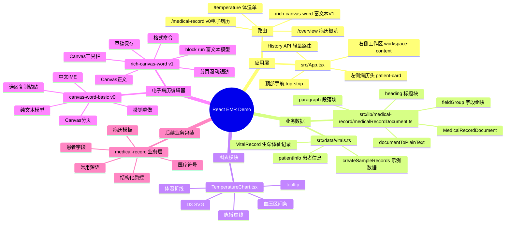
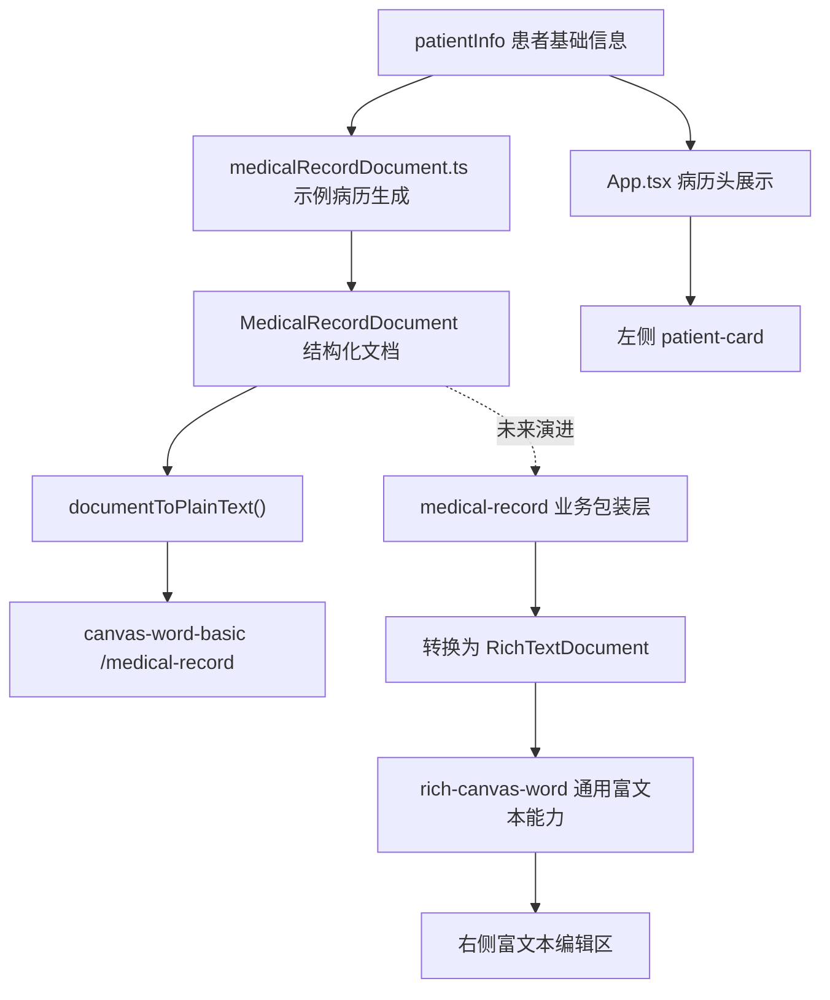
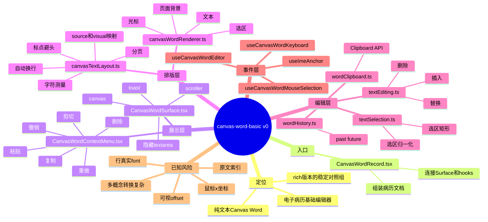
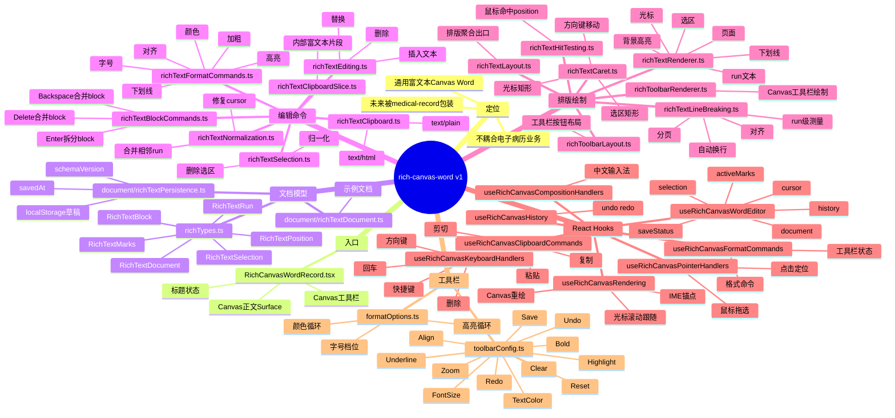
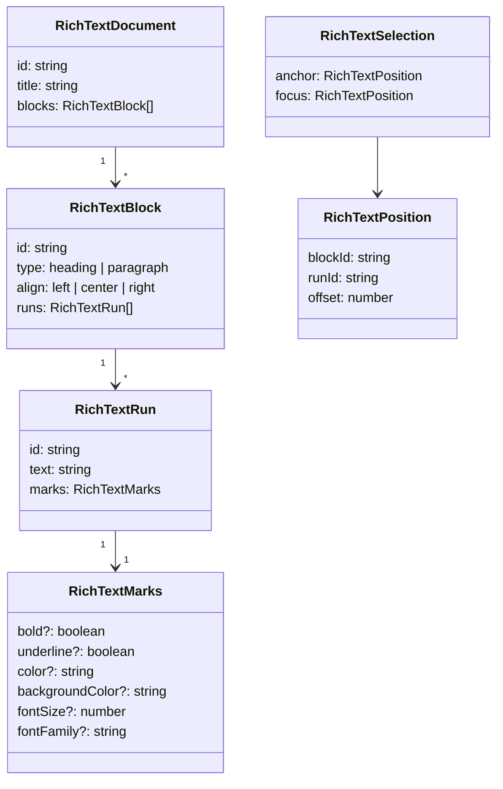
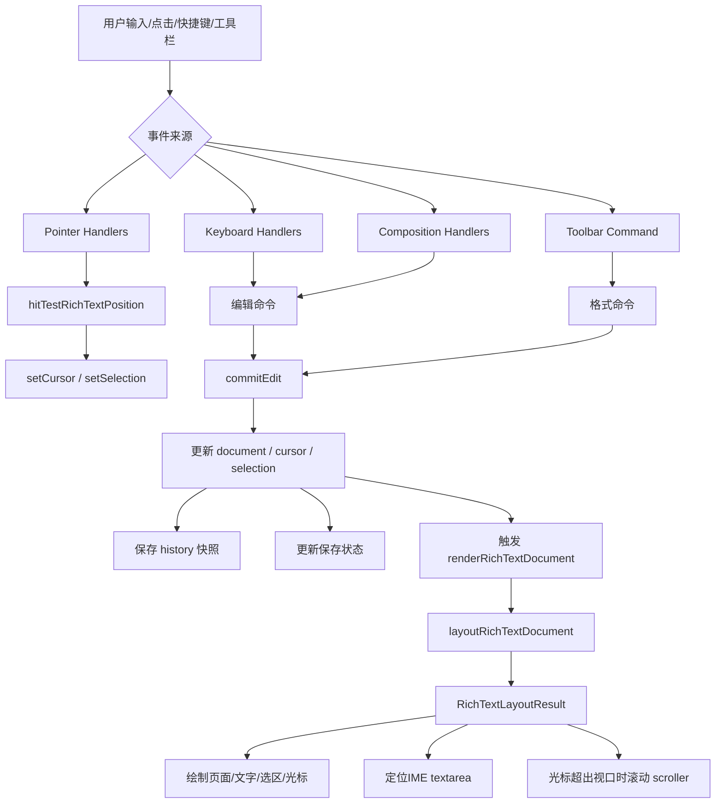
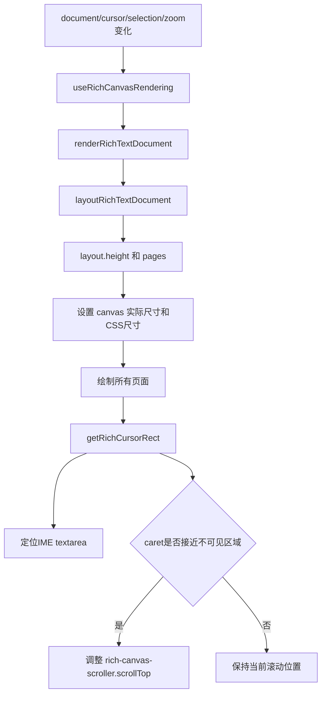
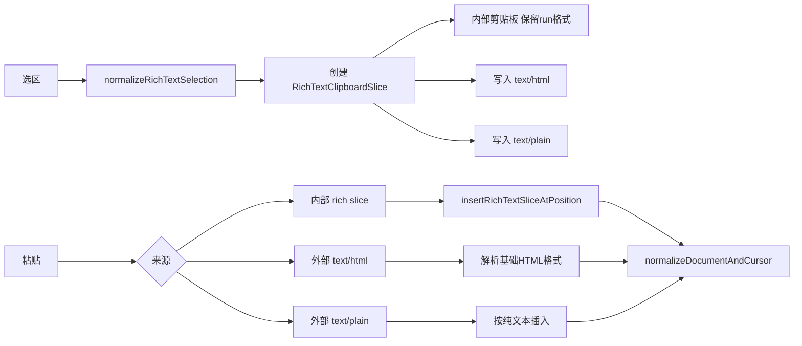
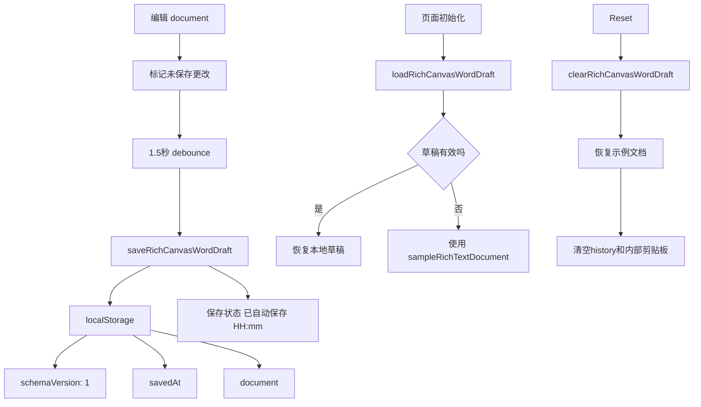
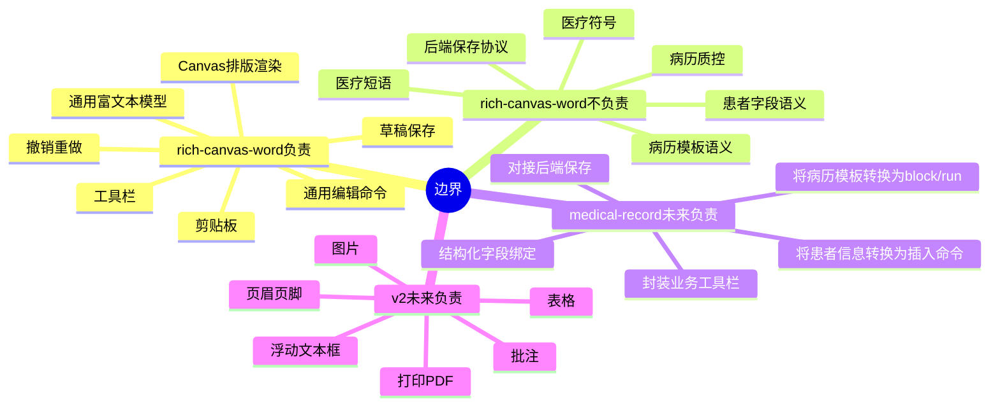

# 电子病历与 Rich Canvas Word 架构思维导图

本文用于快速理解当前项目中电子病历、`canvas-word-basic` 和 `rich-canvas-word` 的整体脉络。它不是替代详细设计文档，而是把模块关系、数据流、编辑链路和后续演进压缩成一张可读的架构地图。

## 总览



## 电子病历主线



当前 `/medical-record` 仍走 v0 纯文本链路：结构化病历先转成纯文本，再交给 `canvas-word-basic` 编辑。未来更理想的路线是让 `medical-record` 业务层把病历结构转换为 `RichTextDocument`，再调用 `rich-canvas-word` 的通用编辑命令。

## v0：canvas-word-basic



v0 的核心模型很简单：

```ts
type PlainEditorState = {
  text: string;
  cursor: number;
  selection: { anchor: number; focus: number } | null;
};
```

它的优势是稳定、直观、依赖少；限制是无法自然表达同一段文字内的不同字号、颜色、加粗、下划线和段落对齐。因此 v1 没有继续在 v0 上堆功能，而是新建了 `rich-canvas-word`。

## v1：rich-canvas-word



## 富文本数据模型



理解这个模型的关键：

- `block` 是段落或标题。
- `run` 是一段样式连续的文字。
- `marks` 是这段文字的字符级样式。
- `position` 不用全局字符索引，而用 `blockId + runId + offset`。
- `selection` 保存原始方向，使用前再归一化。

## Rich Canvas Word 编辑链路



这条链路里最重要的分工是：

- 编辑命令只更新文档模型，不关心 Canvas 像素。
- layout 负责把文档变成视觉行、fragment、页面高度和坐标。
- renderer 负责画出来，不直接修改 React 状态。
- hook 负责把 React 状态、DOM 事件、Canvas 绘制和输入代理接起来。

## 分页与滚动逻辑



当前已修复的问题：

- 当输入内容增长到新页面时，Canvas 会生成新页。
- 光标进入新页后，滚动容器会自动滚动到光标附近。
- 用户不再需要手动滚轮追踪下一页编辑位置。

## 复制粘贴与格式保留



## 持久化与保存状态



## 当前边界



## 推荐阅读顺序

1. 先读 [README.md](./README.md)，了解项目状态。
2. 再读 [02-technical-architecture.md](./02-technical-architecture.md)，理解页面和模块边界。
3. 如果关心 v0 编辑器，读 [05-canvas-editor-architecture.md](./05-canvas-editor-architecture.md) 和 [08-canvas-word-record-refactor-plan.md](./08-canvas-word-record-refactor-plan.md)。
4. 如果关心 rich editor，读 [09-rich-canvas-word-v1-plan.md](./09-rich-canvas-word-v1-plan.md) 和 [10-rich-canvas-word-next-plan.md](./10-rich-canvas-word-next-plan.md)。
5. 如果要接入电子病历业务层，从 [07-canvas-word-version-roadmap.md](./07-canvas-word-version-roadmap.md) 的 `medical-record` 包装层规划开始。

## 一句话架构总结

当前项目把“医疗业务语义”和“通用文档编辑能力”拆开：`medical-record` 负责患者、诊断、模板等业务概念，`rich-canvas-word` 负责通用富文本编辑器内核，`App.tsx` 负责把它们放进可演示的 EMR 页面里。
